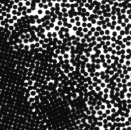
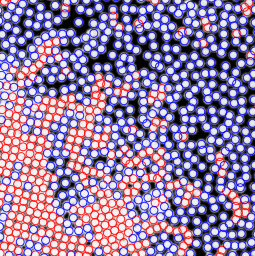

#Welcome to PTrack2 Wiki Page

PTrack2 is a particle recognition software implemented in C++, using some well known design patterns enabling extensibility and code reuse. This software is based on **Mauricio Cerda** C first implementation and **Scott Waitukaitis** variant to recognize particles in high density images for the **Physics department of University of Chile**. The algorithm used is based on the first particle recognition algorithm using convolution based least-squares fitting of **Professor Mark D. Shattuck** implemented in [Matlab](http://gibbs.engr.ccny.cuny.edu/technical/Tracking/ChiTrack.php).

* [Develop](develop.md)
* [Extension](extension.md)
* [Install](install.md)
* [Configuration](config.md)
* [Use](use.md)
* [Frequent Errors](faq.md)
* [Benchmarking](benchmarking.md)
