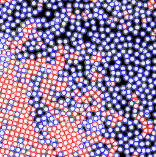

#Welcome to PTrack2 Wiki Page

PTrack2 is a particle recognition software implemented in C++, using some well known design patterns enabling extensibility and code reuse. This software is based on **Mauricio Cerda** C first implementation and **Scott Waitukaitis** variant to recognize particles in high density images for the **Physics department of University of Chile**. The algorithm used is based on the first particle recognition algorithm using convolution based least-squares fitting of **Professor Mark D. Shattuck** implemented in [Matlab](http://gibbs.engr.ccny.cuny.edu/technical/Tracking/ChiTrack.php).

* [Develop](Docs/en/develop.md)
* [Extension](Docs/en/extension.md)
* [Install](Docs/en/install.md)
* [Configuration](Docs/en/config.md)
* [Use](Docs/en/use.md)
* [Frequent Errors](Docs/en/faq.md)

# Notes
2015-10-06
It is very important when working with OSX (Latest versions ex El Capitan) to properly install Xcode and the commands tools.
This should be done by executing `xcode-select --install` in a terminal. Not doing so may present issues when installing and executing.

2015-10-07
Due to changes in ImageMagick some image are now treated as sRGB generating some errors when reading.
Please change the color space of those images to RGB if present problems.
http://www.imagemagick.org/discourse-server/viewtopic.php?f=4&t=21269
